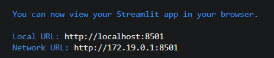
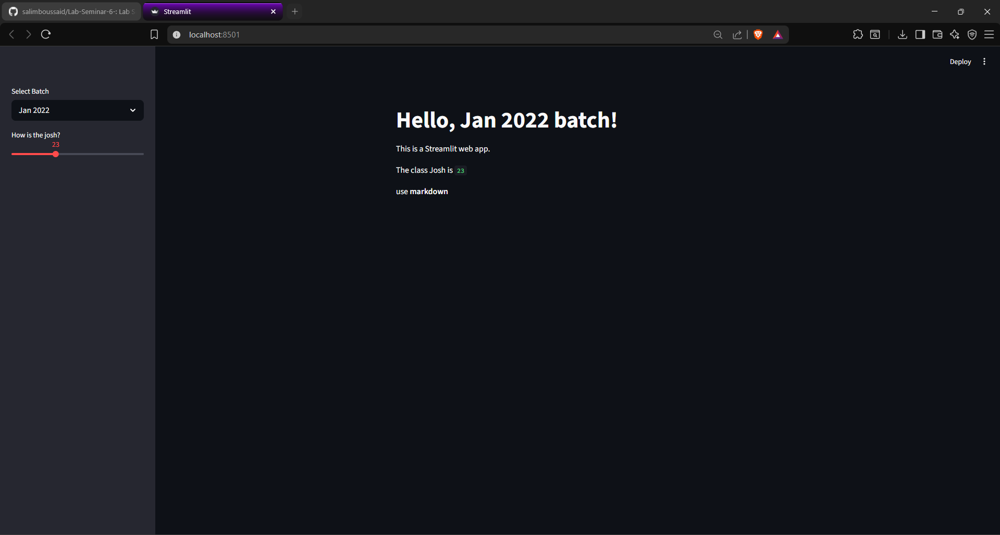
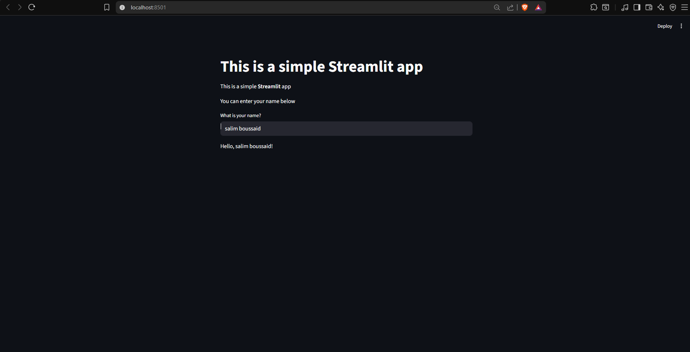
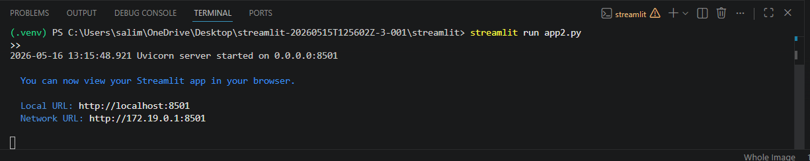
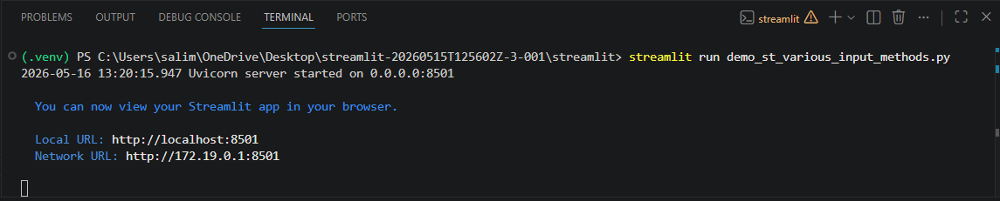
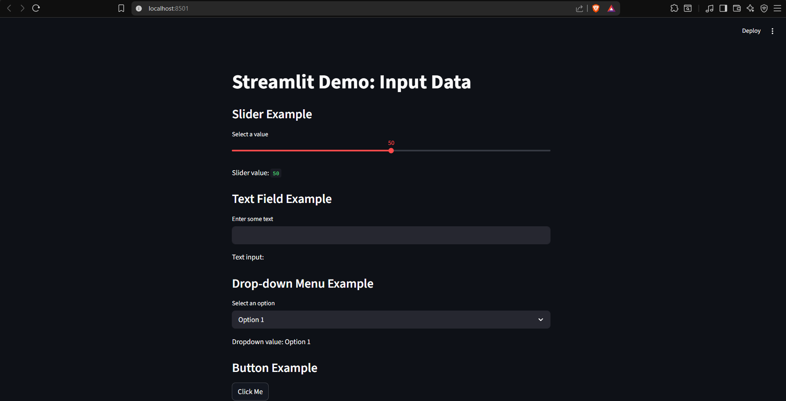
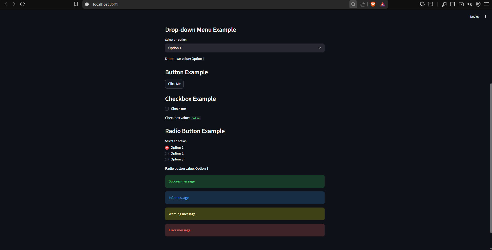
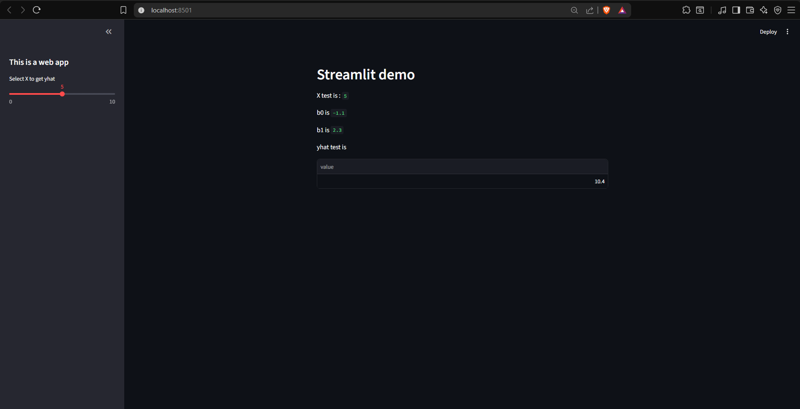

# Lab Seminar #6 & 7. (Workshop). ML Models Deployment using Streamlit

**Name:** boussaid Mohamed salim

## Lab 1

In this lab, I checked the Streamlit setup, opened the project folder, and ran `app.py` to test a simple web app with sidebar user inputs.

### Screenshots

<p align="center">
  
  
</p>

### Command

```bash
streamlit run app.py
```

## Lab 2

In this lab, I ran `app2.py` and learned how Streamlit displays formatted messages using Markdown. The app shows a title, bold text, a text input, and a greeting message with the entered name.

### Screenshots

<p align="center">
  
  
</p>

### Command

```bash
streamlit run app2.py
```

## Lab 3

In this lab, I ran `demo_st_various_input_methods.py` and learned different ways to accept user inputs in Streamlit. The app demonstrates a slider, text field, drop-down menu, button, checkbox, radio buttons, and message boxes.

### Screenshots

<p align="center">
  
</p>

<p align="center">
  
  
</p>

### Command

```bash
streamlit run demo_st_various_input_methods.py
```

## Lab 4

In this lab, I ran `app3.py` and tested a Streamlit web app that uses a simple linear regression model. The app lets the user change `X_test` with a sidebar slider, then displays the model intercept, coefficient, and predicted `y` value.

### Screenshots

<p align="center">
  
</p>

### Command

```bash
streamlit run app3.py
```
